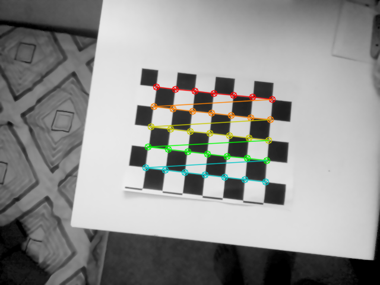
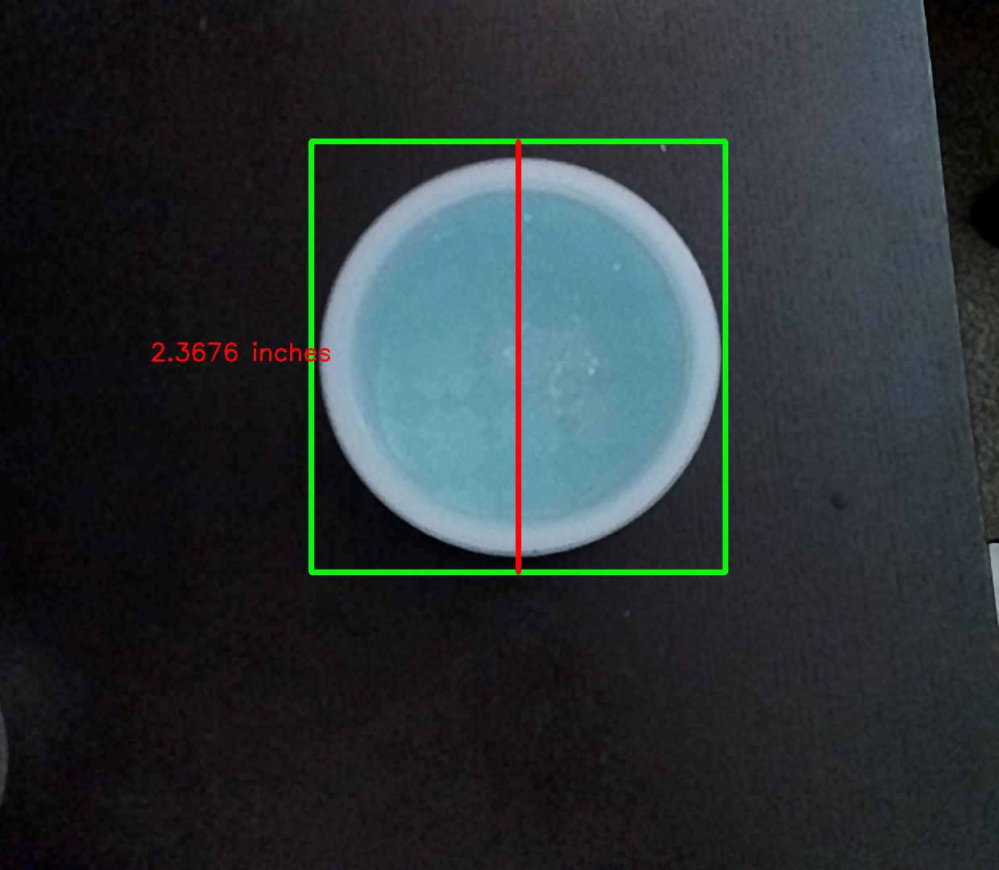

# Assignment 1 Solutions for Computer Vision

## Problem 1

For camera calibration, an 8x6 checkerboard pattern was employed. 

The code for capturing 10 images of the checkerboard using both monochrome (left and right) and rgb cameras is available in the `A1_Q1.ipynb` file. These images are stored in the 'images' directory.

After capturing, these images were utilized to compute the camera matrix, as well as the translation and rotation vectors.

The corrected images are saved in the 'images' folder, while the respective camera parameters are stored in folders labeled 'left', 'right', and 'rgb'.

 |  | 

---

## Problem 2

Using the derived camera matrix, rotational matrix, and translation matrix from Problem 1, pixel coordinates were transformed into world coordinates.

In the 3D space distance measurement, two pixel coordinates from an image were converted to world coordinates using these matrices, determining the actual real-world distance.

The rotation matrix was successfully computed from the extrinsic parameters, followed by calculating rotation angles on each axis. The sequence of rotation was determined based on the experimental setup and requirements.

---

## Problem 3

A script was devised to utilize perspective projection equations to ascertain real-world dimensions, specifically for a circular object.

To affirm the accuracy of these calculations, an demo is provided where an object was imaged from a set distance, ensuring precise measurements for accurate outcomes.

---

## Problem 4

[Video Link](https://youtu.be/JIMiq465JRc)

A web application was developed to compute the real-world dimensions of objects in view. 

This application operates seamlessly in a web browser, ensuring compatibility across various platforms.

To simplify usage, the application includes user-friendly features such as enabling users to pinpoint areas of interest on the object image.

| App Capture Page | App Result Page |
|------------------|-----------------|
|  |  |

### Application in Action

| Object Image | Annotated Image |
|--------------|-----------------|
|  |  |
