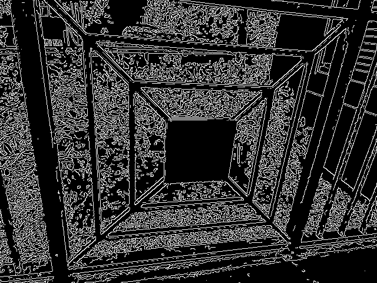
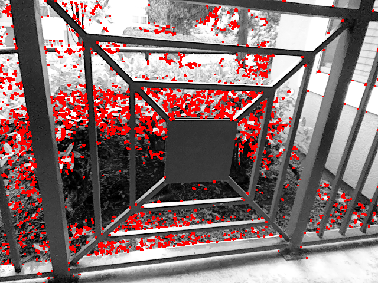
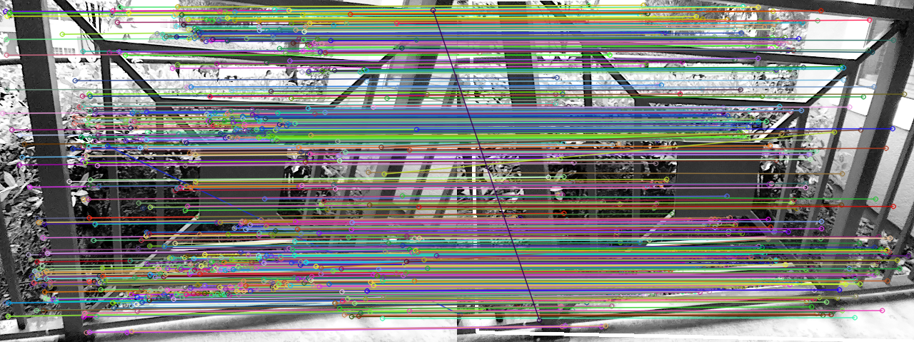
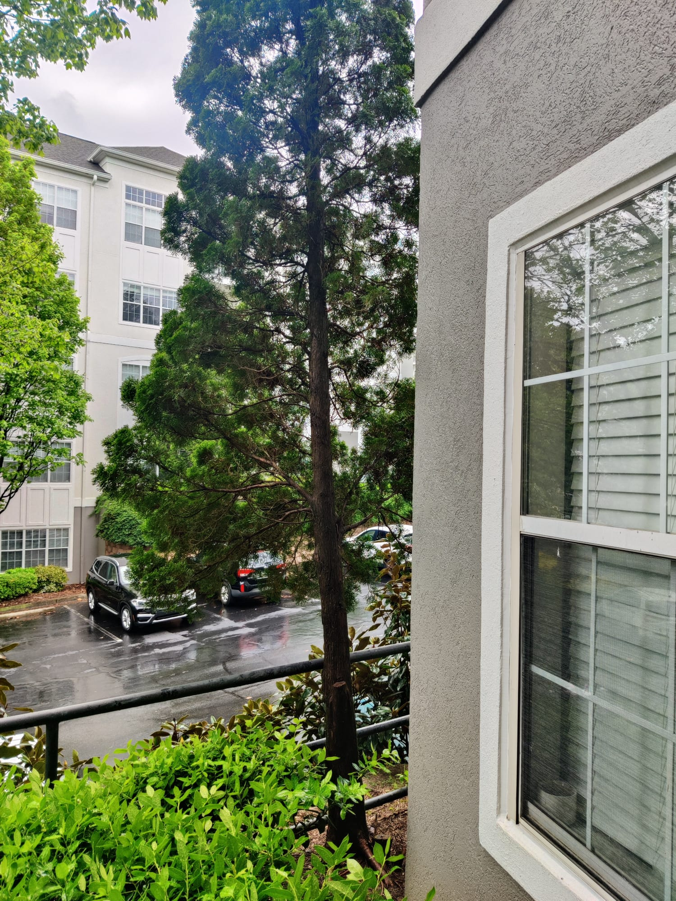
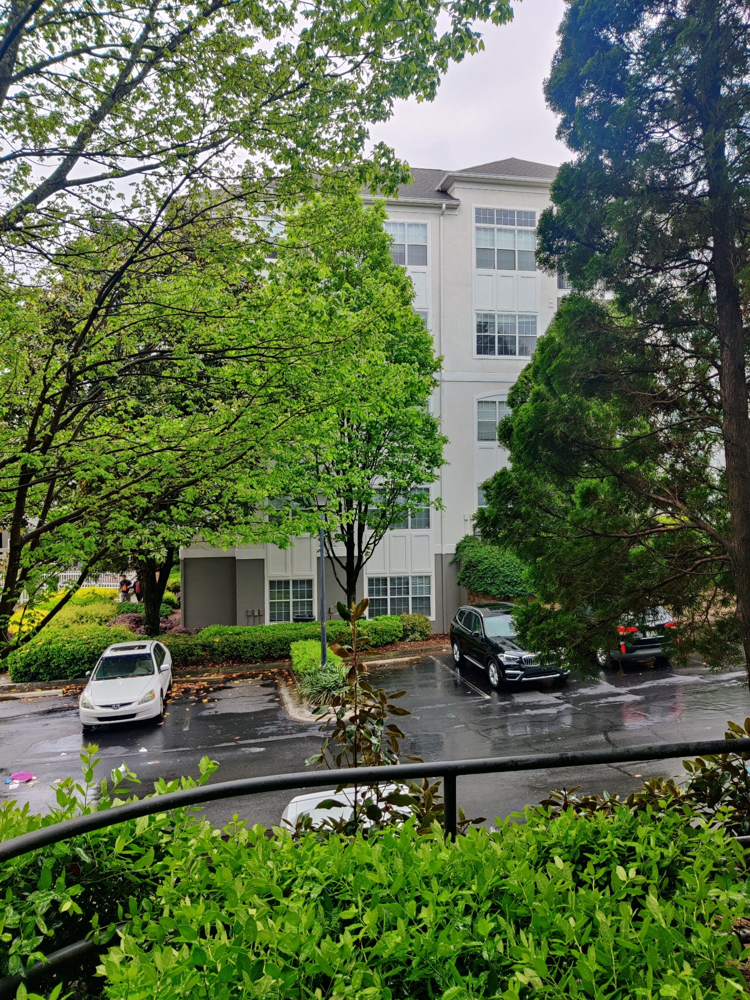
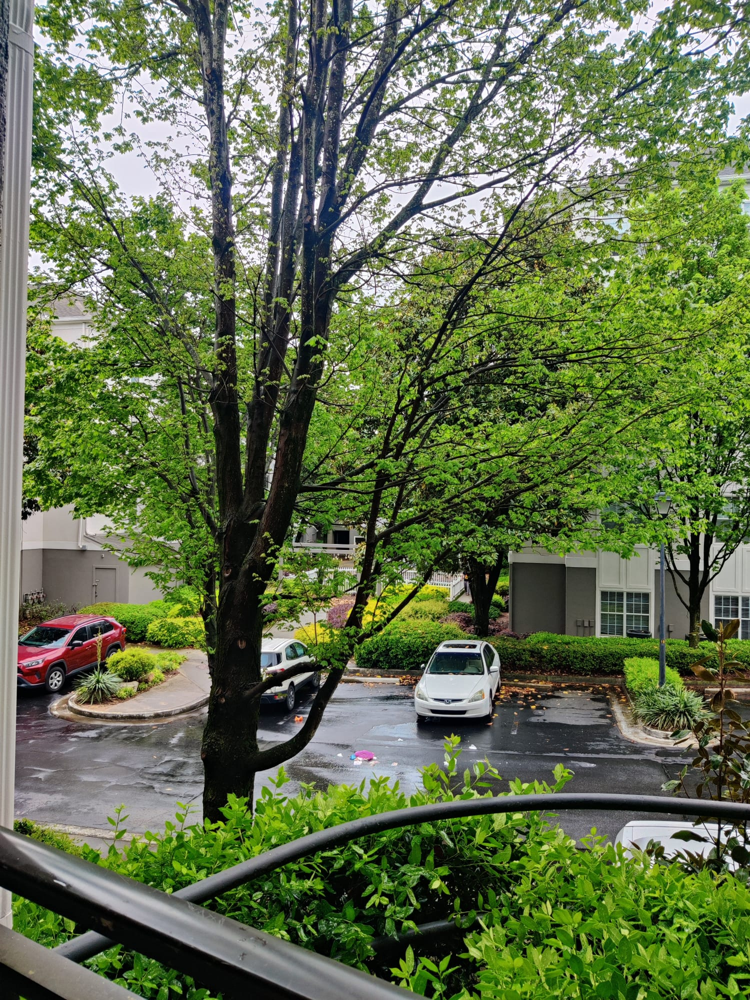
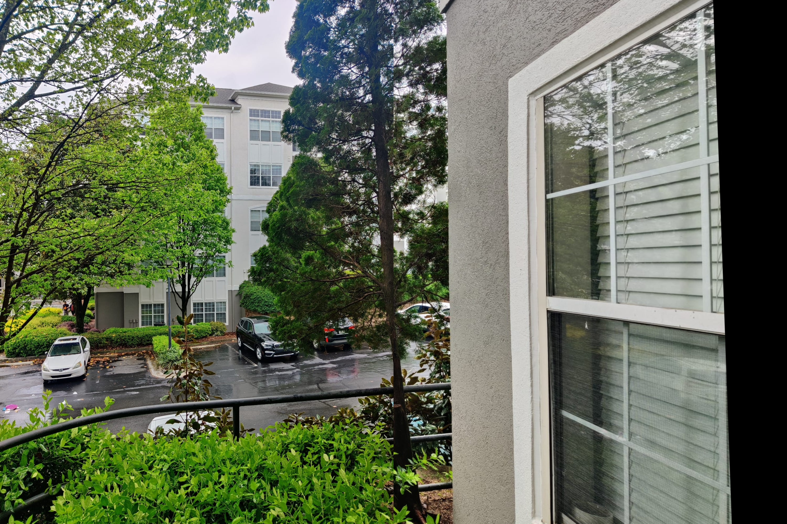
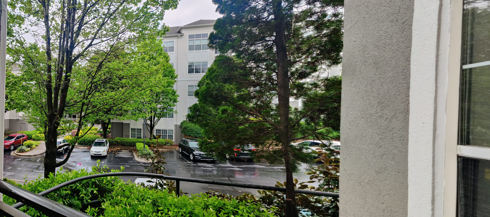

# CSc 8830: Computer Vision - Assignment 2 Solutions

## Question 1

The solution for this question is provided in the 'A2_Q1.ipynb' file.

The code prompts the user to record a 10-second video, storing its frames in the "video_frames" folder. A random frame from this video underwent Canny edge detection and was saved as 'canny_edge_detection.png'.

___

## Question 2

For this question, we manually applied the Harris corner detection algorithm to a 5x5 image patch within a selected region that harbored a corner of interest. This manual detection was then compared with the automated implementation using DepthAI's Harris corner detection function.

The detailed solution is available in 'A2_Q2.ipynb'.

___

## Question 3

We implemented the SIFT feature extraction and matching algorithm to calculate the sum of squared differences (SSD) between super-pixel patches from two 'video_frames' images separated by at least 2 seconds with some scene overlap. We also computed the Homography matrix and its inverse using Python.

Find the solution in 'A2_Q3.ipynb'.

___

## Question 4

We designed a code to display the integral image feed alongside the RGB feed without relying on any built-in integral image functions. The integral image was initialized to zero, pixel values were copied from the grayscale image, and the integral image was computed using the integral image algorithm.

**Integral Image Matrix:** [Integral Image Matrix File](integral_matrix.txt)

**Integral Image Display for image.jpg:**

___

## Question 5

We successfully implemented real-time image stitching for creating 360-degree panoramic outputs using SIFT or ORB features. The panoramas were constructed from images of home and science buildings without using direct built-in image stitching functions.

The solution can be found in 'A2_Q5.ipynb'.

**Images of Home Buildings Used:** 

**Home Buildings SIFT Stitching:** 

**Home Buildings ORB Stitching:** 

**Home Buildings SIFT Stitching Panorama:** 

___

## Question 6

We integrated the applications developed for questions 4 and 5 into a web application.

[Demo Video Link](https://youtu.be/LWzCbX0lU38)

**Home Page:** 

**Problem 4 Solution:** 

**Problem 5 Solution:** 

