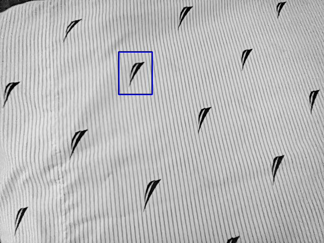

# CSc 8830: Computer Vision : Assignment 3 Solutions

## Question 1

The code initiates by prompting the user to record a 10-second video, with each frame being saved in the "video_frames" directory.

Subsequently, one frame is chosen from this footage, and a region of interest (ROI) corresponding to an object within this selected frame is extracted. This cropped region serves as the reference for comparison.

Random frames from the dataset of 10-second video frames are then selected. The object in the cropped region is compared with the corresponding regions in these randomly chosen frames.

Two methods are employed for comparison: sum of squared differences (SSD) and normalized correlation. These techniques measure the similarity between the reference object and the objects present in the randomly selected frames.

## Region of Interest :

# Few matched images using SDD and Normalized Correlation
|  SSD | Normalized Correlation |
|---------|---------|
|  |  |

___

## Question 2

The motion tracking equation is derived from fundamental principles of optical flow estimation, which aims to compute the apparent motion of objects between consecutive frames in a video sequence. 

The Lucas-Kanade algorithm, a widely used method in computer vision, particularly for tracking motion in image sequences, provides a framework for estimating the motion parameters.

At its core, the Lucas-Kanade algorithm assumes that the motion between frames is locally approximated as an affine transformation. 

[Solution](A3_Q2.pdf)
___

## Question 3

The distance to a marker from a stereo camera setup is estimated by computing the disparity map between two images and converting it into a depth map, utilizing stereo vision theory.

___

## Question 4

In this solution I plotted optical flow vectors on each frame of the video using MATLAB's optical flow codes, considering three different reference frame strategies:

## 1) treating every previous frame

| Optical Flow Image | Optical Flow Mask |
|--------------------|-------------------|
|  |  |

## 2) every 11th frame

| Optical Flow Image | Optical Flow Mask |
|--------------------|-------------------|
|  |  |

## 3) every 31st frame

| Optical Flow Image | Optical Flow Mask |
|--------------------|-------------------|
|  |  |
___

## Question 5

# Feature-Based Object Detection with OAK Camera

Template matching techniques are utilized to detect objects of interest within the scene, visually highlighted by sqaures. 

| Pattern 1 | Pattern 2 |
|--------------------|-------------------|
| |  |

# Pattern Matching 

___

## Question 6

# Bag of Features
For this evaluation, I chose two common object categories: 'cutlery/stationery'. 

The evaluation involved assessing the accuracy and effectiveness of the Bag of Features approach in classifying objects from these categories, providing insights into its performance.

___

## Question 7

The rotation angle was noted down during the experiment. 

Completed the MATLAB tutorial on uncalibrated stereo image rectification using the captured image pairs. 

The assumptions made during the experiment have been justified in the accompanying description.

___

## Question 8

The initial version employs a marker, such as a QR code or April tags, to track objects, whereas the second version tracks objects solely based on their characteristics without the need for any marker.

Both versions showcase real-time object tracking capabilities, offering flexible solutions for various object tracking requirements.

| Detected QR Code (Marker) |
|-----------------------------|
|  |

| Tracked Object (No Marker) |
|----------------------------|
|  |

