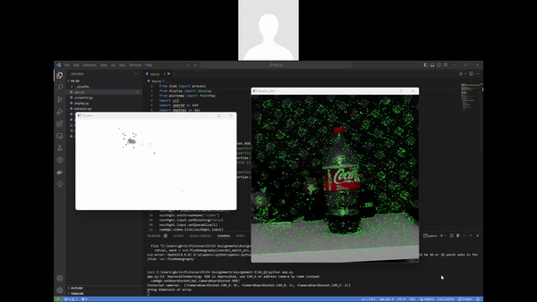
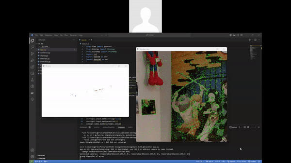
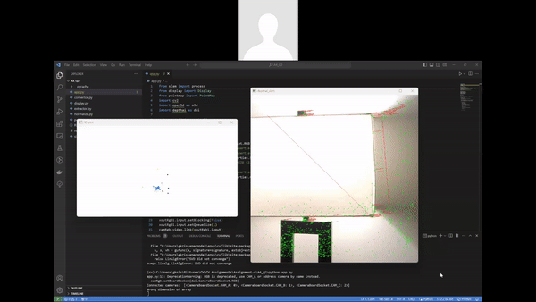

# CSc 8830: Computer Vision : Assignment 4 Solutions

## Question 1

The developed application utilizes a stereo camera to perform object recognition, tracking, and dimension estimation within a 3-meter range and within the camera's field of view.

It accomplishes this without employing machine learning or deep learning tools, relying instead on computer vision techniques like object detection, tracking, and dimension estimation.

In summary, the application offers a reliable solution for object tracking and dimension estimation utilizing stereo camera technology, free from dependency on machine learning or deep learning algorithms.

**App Demo:**

  
___

## Question 2

Below are some observed limitations and corner cases I encountered while utilizing the DepthAI SDK with ORB-SLAM3:

1. **Challenges in Varied Lighting Conditions**: Both the DepthAI SDK and ORB-SLAM3 exhibit difficulty in low-light environments or when lighting conditions are highly inconsistent. Such conditions can result in inaccuracies in depth estimation and feature tracking, leading to tracking loss or drift over time.

2. **Textureless Surface Difficulty**: Surfaces lacking distinct texture or features present a significant challenge for both systems. In such cases, SLAM algorithms may struggle to accurately estimate the camera's pose, affecting overall mapping and localization accuracy.

3. **Dynamic Environment Interference**: Moving objects within the scene can be incorrectly identified as static features by the SLAM system, introducing inconsistencies in mapping and localization.

4. **Impact of Large Camera Movements**: Rapid or extensive camera movements may induce motion blur and disrupt feature tracking. Consequently, this can lead to inaccuracies in pose estimation and compromise the quality of mapping and localization results.

5. **Resource Intensiveness**: SLAM algorithms are often computationally demanding, particularly when processing high-resolution images or operating in real-time on embedded devices. Limited computational resources may result in compromised performance or slower mapping and localization processes.

During experimentation in various environments, several instances exemplify these challenges. Additional screenshots and screencaptures demonstrating these scenarios can be found within A4_Q2 folder.

| Environment Location 1 | Environment  Location 2 | Environment  Location 3 |
|---------------|---------------|---------------|
|  |  |  |
